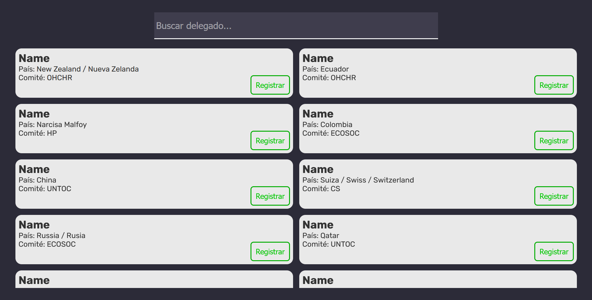

# MUNMX REGISTER

MUNMX Register is a [Next.js](https://nextjs.org/) project that also implements [MongoDB](https://www.mongodb.com/). It is deployed on vercel and can be accessed with the following [link](https://munmx-registro.vercel.app/).

It was developed to create a better system to register the delegates for [MUNMX 2024](https://munmxsal.vercel.app/). It simplifies the process to find a delegate, and minimizes the error possibilities for anyone using the app.
